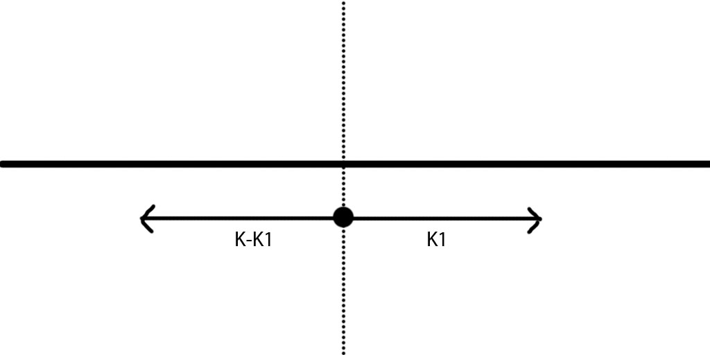

# [Sliding Window Maximum](https://leetcode.com/explore/interview/card/top-interview-questions-hard/116/array-and-strings/837/)
[239](https://leetcode.com/problems/sliding-window-maximum/description/)

## [O(n) solution in Java with two simple pass in the array](https://leetcode.com/explore/interview/card/top-interview-questions-hard/116/array-and-strings/837/discuss/65881/O(n)-solution-in-Java-with-two-simple-pass-in-the-array)
For Example: A = [2,1,3,4,6,3,8,9,10,12,56], w=4

partition the array in blocks of size w=4. The last block may have less then w.
2, 1, 3, 4 | 6, 3, 8, 9 | 10, 12, 56|

Traverse the list from start to end and calculate max_so_far. Reset max after each block boundary (of w elements).
left_max[] = 2, 2, 3, 4 | 6, 6, 8, 9 | 10, 12, 56

Similarly calculate max in future by traversing from end to start.
right_max[] = 4, 4, 4, 4 | 9, 9, 9, 9 | 56, 56, 56

now, sliding max at each position i in current window, sliding-max(i) = max{right_max(i), left_max(i+w-1)}
sliding_max = 4, 6, 6, 8, 9, 10, 12, 56

code:
```java
 public static int[] slidingWindowMax(final int[] in, final int w) {
    final int[] max_left = new int[in.length];
    final int[] max_right = new int[in.length];

    max_left[0] = in[0];
    max_right[in.length - 1] = in[in.length - 1];

    for (int i = 1; i < in.length; i++) {
        max_left[i] = (i % w == 0) ? in[i] : Math.max(max_left[i - 1], in[i]);

        final int j = in.length - i - 1;
        max_right[j] = (j % w == 0) ? in[j] : Math.max(max_right[j + 1], in[j]);
    }

    final int[] sliding_max = new int[in.length - w + 1];
    for (int i = 0, j = 0; i + w <= in.length; i++) {
        sliding_max[j++] = Math.max(max_right[i], max_left[i + w - 1]);
    }

    return sliding_max;
}
```

## O(n)
从某个固定位置开始扫描数组时，每一步都可以用`O(1)`的时间得到起始位置到当前位置的最大值。但是当起始位置不断被移出，因为无法用`O(1)`时间得到第二大值，所以无法用`O(1)`的时间维护最大值。

试想起始位置的元素不是被移除出去，而是从数组另一个方向扫描过来，但未扫描到该位置，则可以避免查找第二大值的问题：


如上图所示，从数组中若干条虚线出发，向两个方向扫描。则两个箭头之间的最大值为前面$k-k_1$个元素的最大值和后面$k_1$个元素最大值两者最大值。而两个最大值均是从固定位置开始扫描，都可以在线性时间内得到。

这若干虚线分别是`k, 2k, 3k, ...`。位置`i`的最大值为`max(right_to_left(i), left_to_right(i+k-1))`

## 976ms: `Deque`
构建一个`Deque`，存储元素的索引值。从左向右扫描数组，当`Deque`左端的索引超出窗口范围，将其移除。当右端元素值比当前扫描到元素值`nums[i]`小时，循环将右端小于`nums[i]`的值都移除。然后把`i`放入右端。因为原来右端的元素肯定先比`i`先超出窗口范围，而其值又比`nums[i]`小，只要原来右端的值还在窗口内，`nums[i]`就存在，且比它大，所以就没有必要把原来右端的值留在`Deque`内了。由于这种插入方式，每个值总是小于或等于他左边的值，所以左端的值总是最大值，可以在`O(1)`时间内取得。
```go
type Node struct {
	val        int
	prev, next *Node
}

func (n *Node) String() string {
	return fmt.Sprintf("{%d, %s}", n.val, n.next)
}

type Deque struct {
	front, back *Node
}

func (d *Deque) String() string {
	return fmt.Sprintf("%s", d.front)
}
func (d Deque) IsEmpty() bool { return d.front == nil }
func (d *Deque) Push(x int) {
	n := &Node{val: x, prev: d.back, next: nil}
	if d.front == nil {
		d.front = n
	}
	if d.back == nil {
		d.back = n
	} else {
		d.back.next, d.back = n, n
	}
}
func (d *Deque) Peek() int     { return d.front.val }
func (d *Deque) PeekBack() int { return d.back.val }
func (d *Deque) Pop() int {
	f := d.front
	d.front = d.front.next
	if d.front == nil {
		d.back = nil
	} else {
		d.front.prev = nil
	}
	return f.val
}
func (d *Deque) PopBack() int {
	b := d.back
	d.back = d.back.prev
	if d.back == nil {
		d.front = nil
	} else {
		d.back.next = nil
	}
	return b.val
}

func maxSlidingWindow(nums []int, k int) []int {
	if len(nums) == 0 {
		return nil
	}
	output := make([]int, len(nums)-k+1)
	d := Deque{}
	for i := 0; i < len(nums); i++ {
		if !d.IsEmpty() && d.Peek() < i-k+1 {
			d.Pop()
		}
		for !d.IsEmpty() && nums[i] >= nums[d.PeekBack()] {
			d.PopBack()
		}
		d.Push(i)
		if i-k+1 >= 0 {
			output[i-k+1] = nums[d.Peek()]
		}
	}
	return output
}
```