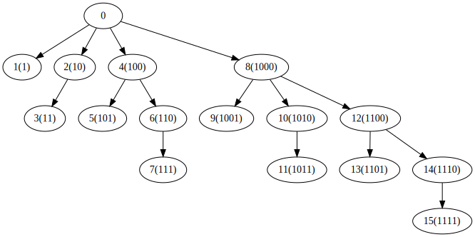

# [Count of Smaller Numbers After Self](https://leetcode.com/explore/interview/card/top-interview-questions-hard/118/trees-and-graphs/851/)
[315](https://leetcode.com/problems/count-of-smaller-numbers-after-self/description/)

## [树状数组](https://zh.wikipedia.org/wiki/%E6%A0%91%E7%8A%B6%E6%95%B0%E7%BB%84)
`二叉索引树(Binary Indexed Tree)`

`Fenwick Tree`

问题：计算前缀和、修改元素值
- `O(1)`获取前缀和，则元素修改时间为`O(n)`
- `O(1)`修改元素值，则获取前缀和时间为`O(n)`

折中：使获取前缀和和修改元素时间复杂度均为`O(log n)`

原理：
1. `LSB(i)` 表示数字 `i` 的 `最低有效位(Least Significant Bit)`。
    
    如 `LSB(6)=LSB(0b0110)=0b0010=2`

2. $sum(i) = \sum_{j=1}^{i}{a_j}=\sum_{j=1}^{i_1}{a_j}+\sum_{j=i_1+1}^{i_2}{a_{i_2}}+\dots+\sum_{j=i_{n-1}+1}^{i}{a_j}$
   
   把前缀和看成若干区间的和相加。
   
   注意：**j从1开始**

3. 如何划分：
   

   上图为`Fenwick Tree`。节点 `x` 表示区间 `[x-LSB(x)+1, x]` 的区间和。求 `[1, x]` 前缀和，只需要从 `x` 开始向父节点遍历，直到根节点，所有遍历节点的和即为前缀和。`x` 的父节点为 `x-LSB(x)`，即 `x` 去掉最低位。
   
   `x` 节点及其子孙节点表示 `x` 的比 `LSB` 更高位不变，`LSB`位以及更低位任意变化的索引范围内的元素的和。`x`表示 `LSB` 为 `0` 的索引范围，`x`的子孙节点表示 `x` 的 `LSB` 为 `1` 的索引范围(但是 `LSB` 为 `1`, 更低位全为 `0` 的索引放在 `x` 节点)。
   
   假设 `BIT(x)` 表示 `[x-LSB(x)+1, x]` 的区间和。
   
   如：`BIT(0bD_1000)` 表示 `[0bD_0001, 0bD_1000]` 的区间和。
   
   则：`sum(x) = BIT(x) + BIT(x-LSB(x)) + BIT(x-LSB(x) - LSB(x-LSB(x))) + ...`

   如：`sum(0b1110)=BIT(0b1110)+BIT(0b1100)+BIT(1000)`
   
   构建 `BIT`：
   ```c
    void build() { 
        for (int i = 1; i <= MAX_N; i++)
        {
            BIT[i] = A[i - 1];
            for (int j = i - 2; j >= i - lowbit(i); j--)
                BIT[i] += A[j];
        }
        // BIT[i] = sum(A[i-lowbit(i)+1-1],...,A[i-1])
    }
    // 注：BIT中的index，比原数组中大1
    // 这里的求和将汇集到非终端结点（0bD00形式）
    // BIT中仅非终端结点i值是 第0~i-1元素的和
    // 终端结点位置的元素和，将在求和函数中求得
   ```
   求和：
   ```c
    int sum (int k) {
        int ans = 0;
        for (int i = k; i > 0; i -= lowbit(i))
            ans += BIT[i];
        return ans;
    }
   ```

4. 如何修改元素值：
   
   由于 `sum` 的值由 `BIT` 决定，所有考虑哪些 `BIT` 会受到元素 `a[i]` 影响。`BIT(x)` 表示 `[x-LSB(x)+1, x]` 的区间和，即考虑哪些 `x` 会使 `i` 会落在哪些的 `[x-LSB(x)+1, x]` 区间。

   `BIT(i)`, `BIT(i+LSB(i))`, `BIT(i+LSB(i) + LSB(i+LSB(i)))`, ...
   
   ```c
    void edit(int i, int delta) {
        for (int j = i; j <= MAX_N; j += lowbit(j))
            BIT[j] += delta;
    }
   ```

### 链接
- [树状数组](https://zh.wikipedia.org/wiki/%E6%A0%91%E7%8A%B6%E6%95%B0%E7%BB%84)
- [Fenwick tree](https://en.wikipedia.org/wiki/Fenwick_tree)
- [A tutorial on Fenwick Trees on TopCoder](https://en.wikipedia.org/wiki/Fenwick_tree)

## 求逆序数
```go
// Fenwick tree
type Fenwick struct {
	BIT []int
}

// Sum sum
func (f *Fenwick) Sum(idx int) int {
	sum := 0
	for idx > 0 {
		sum += f.BIT[idx]
		// 父节点
		idx -= idx & (-idx)
	}
	return sum
}

// Inc inc
func (f *Fenwick) Inc(idx int) {
	for idx < len(f.BIT) {
		f.BIT[idx]++
		// 扩大区间
		idx += idx & (-idx)
	}
}

func countSmaller(nums []int) []int {
	length := len(nums)
	if length == 0 {
		return []int{}
	}

	sorted := make([]int, length)
	copy(sorted, nums)
	sort.Ints(sorted)

	ranks := make(map[int]int, length)
	prev := sorted[0] - 1
	for i, val := range sorted {
		if val != prev {
			ranks[val] = i + 1
		}
		prev = val
	}

	result := make([]int, length)
	f := &Fenwick{make([]int, length)}

	for i := length - 1; i >= 0; i-- {
		val := nums[i]
		rank := ranks[val]
		sum := f.Sum(rank - 1)
		f.Inc(rank)
		result[i] = sum
	}

	return result
}
```